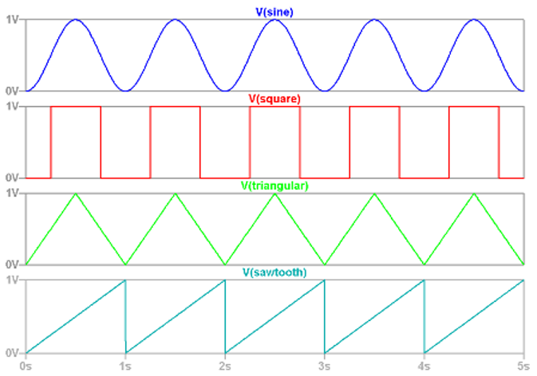
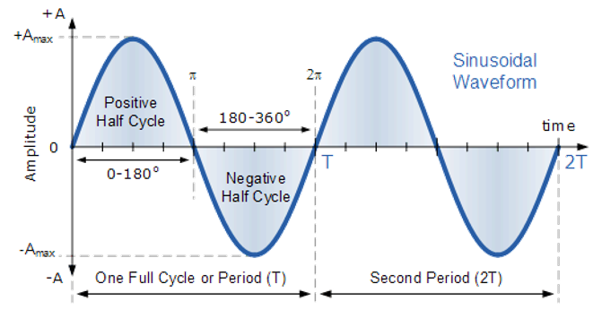

# Signals

## Signal Classification

### Continuous Time and Discrete Time

**Continuous (CT):** Analog, defined in all instants of time $s(t)$

**Discrete (DT):** a continuous signal sampled to intervals of time $s(n \cdot T_S)$

### Periodic and Aperiodic

**Periodic:** repeated after time $T_O (CT)$, or number of samples $N$ (e.g. sine, square, sawtooth)

Formulae:

- continuous signals: $x(t) = x(t + T_O)$
- discrete signals: $x(n) = x(n + N)$

**Aperiodic:** a signal exhibiting no repetition

### Sine Wave Formula

$s(t) = A \cdot cos(2\pi \cdot F_C \cdot t + \phi)$ or $s(t) = A \cdot sin(2\pi \cdot F_C \cdot t + \phi)$

 - $A$: the amplitude of the wave in Volt
 - $F_C$: frequency of the wave in Hertz
 - $T_C = 1/F_C$: period of the wave in seconds
 - $\phi$: phase of the wave, measured in degrees/rad

 
